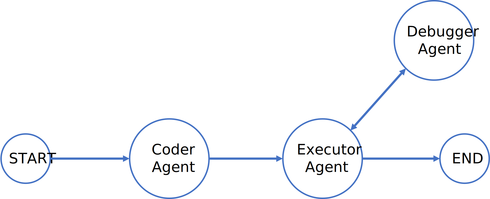

# Python AI Assistant

This a Python AI Assistant made by using langgraph and langchain. The assistant is capable of handling programming tasks in python. Here we use LLM as a router to route the user query to the appropirate agents that were mentioned in graph. Currently this workflow can write script files and fix errors in an existing script file also can give code review and documentation for the script. 
## Graph


## Install Dependencies
Make sure you have Python installed. Then, install the required packages using `pip`:

```bash
pip install -r requirements.txt
```

## Usage
After installing the dependencies, you can start using the Python-Assistant for various tasks. Here is an examples:

Run the app.py
```bash
python app.py

Enter the query: 'Write a python program to do matrix multiplication without using any predefined libraries and finally save the program with name mat.py in current directory.'
```

## Reference

[Future of Coding — Multi-Agent LLM Framework using LangGraph](https://medium.com/@anuragmishra_27746/future-of-coding-multi-agent-llm-framework-using-langgraph-092da9493663)\
[Integrating LangGraph with Ollama for Advanced LLM Applications](https://medium.com/@lifanov.a.v/integrating-langgraph-with-ollama-for-advanced-llm-applications-d6c10262dafa)

## Contact
If you have any questions, suggestions, or feedback, feel free to contact us:

Email: [jeogeoalukka@gmail.com](malto:jeogeoalukka@gmail.com)

Thank you for using Python-Assistant! We hope it helps you in your projects.
