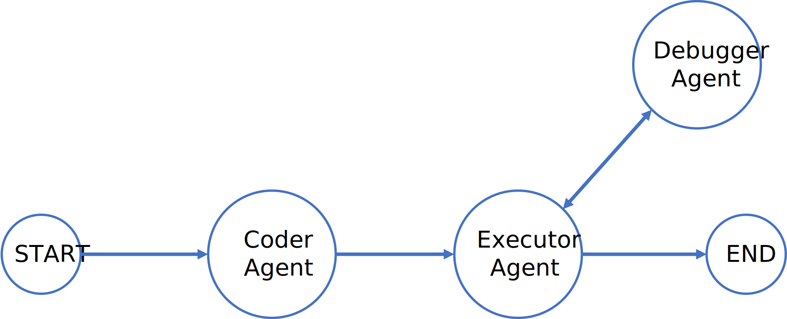

# Python AI Assistant

This an assistant made by using langgraph. This assistant can handle simple programming tasks in python. It has currently three react agents. Coder Agent that does the code writing, Executor Agent does the execution the code, Debugger Agent does the debugging part in case of any issuses with the code. Each agent is assigned with revelant tools to do their part in the task.

## Graph


## Install Dependencies
Make sure you have Python installed. Then, install the required packages using `pip`:

```bash
pip install -r requirements.txt
```

## Usage
After installing the dependencies, you can start using the Python-Assistant for various tasks. Here is an examples:

Run the app.py
```bash
python app.py

```
Enter a query.
```bash
Enter the Query: 'Write a simple program for adding two numbers with user input and save the file in current directory with name add.py'
```
## Contributing
We welcome contributions to Python-Assistant! If you'd like to contribute.

## Reference

[Future of Coding — Multi-Agent LLM Framework using LangGraph](https://medium.com/@anuragmishra_27746/future-of-coding-multi-agent-llm-framework-using-langgraph-092da9493663)\
[Integrating LangGraph with Ollama for Advanced LLM Applications](https://medium.com/@lifanov.a.v/integrating-langgraph-with-ollama-for-advanced-llm-applications-d6c10262dafa)

## Contact
If you have any questions, suggestions, or feedback, feel free to contact us:

Email: [jeogeoalukka@gmail.com](malto:jeogeoalukka@gmail.com)

Thank you for using Python-Assistant! We hope it helps you in your projects.
